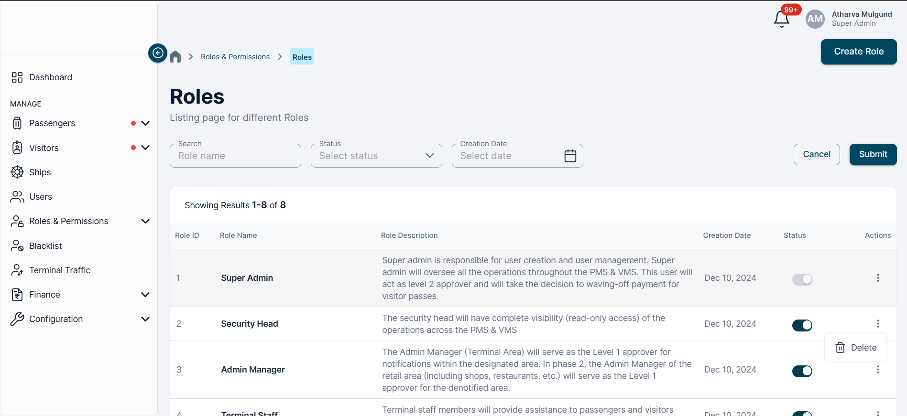

# Overview

 The Roles and Permissions module is designed to manage access control within the application by defining various user roles and assigning them appropriate permissions. This ensures secure and controlled access to features and data based on user responsibility and privilege levels.

This module provides a systematic way to:
- Define roles representing groups of responsibilities.
- Create permissions that encapsulate access rules.
- Map permissions to roles.
- Assign roles to users.
- Enforce access control throughout the application.

It supports scalability and fine-grained access control, which are crucial for enterprise-level applications.

# Role Definitions
A **role** is a collection of permissions that represent a user’s job function or responsibility. Roles simplify access control by grouping related permissions.
A **role** is like a label that tells what a user is allowed to do. Instead of giving each user a list of actions, we create roles (like "Admin" or "Vendor") and put the allowed actions inside them. Then we just assign the role to the user — it's faster and easier to manage.

### System Roles:
- **Super Admin** – Has unrestricted access to all features and settings across the application.
- **Admin Manager** – Manages users, vendors, and configurations at the organization level.
- **Vendor** – Limited access to features related to vendor management and interactions.
- **Custom** – Custom roles created by the organization with a specific set of permissions.

> Roles can be **edited**, **deleted**, or **created** dynamically through the admin interface. However, system roles like `Super Admin` may be protected against deletion to preserve core access.

# Permission Types

A **permission** defines access to a specific action or feature within the system. Permissions are generally action-based and can be applied to various resources like users, vendors, orders, settings, etc.
### Common Action Types:
- **Creation**: e.g., `user:create`, `order:create`
- **Edition**: e.g., `product:edit`, `settings:update`
- **Deletion**: e.g., `user:delete`, `file:remove`
- **Approval**: e.g., `invoice:approve`, `vendor:approve`
- **Rejection**: e.g., `request:reject`, `application:deny`
- **Custom**: e.g., `report:export`, `dashboard:share`, `audit:view`

> Permissions are fully configurable and can be designed to match business-specific workflows or domain logic.

### 🔁 Permission Dependencies

Some permissions imply access to others. For example:
- If a user has `user:edit`, they **must also** have `user:view`, since editing inherently requires the ability to view.
- Similarly, `order:delete` implies `order:view`.

This is known as a **permission dependency** or **implied permission**, and it should be handled either:
- Automatically during role setup (e.g., assigning `edit` also assigns `view`).
- Or enforced by logic in the backend and UI (e.g., throw an error if `edit` is used without `view`).

> ✅ This ensures consistency and avoids access conflicts when rendering data or performing actions.
### Example Permission JSON
```
PASSENGERS: {

    GET_PASSENGERS: "GET_PASSENGERS",

    GET_PASSENGER: "GET_PASSENGER",

    ESCORT_PASSENGER: "ESCORT_PASSENGER",

    UPDATE_PHOTO_PASSENGER: "UPDATE_PHOTO_PASSENGER",

    REGULARIZE_TERMINAL_MOVEMENT: "REGULARIZE_TERMINAL_MOVEMENT",

  },

  SHIPS: {

    GET_SHIPS: "GET_SHIPS",

    GET_SHIP: "GET_SHIP",

  },

  SHIP_CALLS: {

    GET_SHIP_CALLS: "GET_SHIP_CALLS",

    GET_SHIP_CALL: "GET_SHIP_CALL",

    UPDATE_SHIP_CALL: "UPDATE_SHIP_CALL",

  },
```

# Role-Permission Mapping

Each **role** is assigned a set of **permissions** that define what actions and pages a user with that role can access. Permissions are grouped by domain (e.g., FINANCE, PASSENGERS) and support both backend operations and frontend route visibility.

### Example Role-Permission Matrix

| Role          | Permissions                                                                                      |
| ------------- | ------------------------------------------------------------------------------------------------ |
| Super Admin   | All permissions                                                                                  |
| Admin Manager | `PASSENGERS.GET_PASSENGERS`, `PASSENGERS.GET_PASSENGER`, `SHIPS.GET_SHIPS`                       |
| Vendor        | `PASSENGERS.UPDATE_PHOTO_PASSENGER`, `PASSENGERS.REGULARIZE_TERMINAL_MOVEMENT`, `SHIPS.GET_SHIP` |
| Custom        | Configurable at runtime. Can include any combination of permission keys                          |

> Note: Roles can be **created, edited, and deleted** dynamically by authorized users (e.g., Super Admins). However, base roles like `Super Admin` may be locked from deletion.

>Refer to the [useAccessControl hook]([./useAccessControl.md](https://github.com/atharvamulgundeverestek/Documentation/blob/main/JMBAXI%20HOOKS/useAccessControl.md)) for how to implement role-permission checks in the frontend UI.
# Real World Example 



